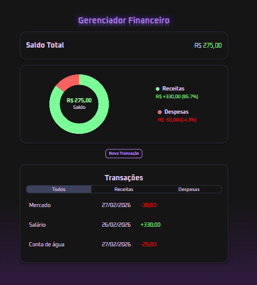

# Gerenciador Financeiro

Aplicação web para controle de receitas e despesas, com cálculo automático de saldo, visualização gráfica e persistência de dados no navegador.

## Funcionalidades

• Adicionar transações
• Editar transações
• Remover transações
• Filtro por tipo (todos/receita/despesa)
• Cálculo automático de saldo
• Gráfico dinâmico com Chart.js
• Persisência com localStorage
• Válidação de valores

## Tecnologias utilizadas

• React
• Chart.js
• CSS
• LocalStorage
• Vite

## Como rodar o projeto

npm install
npm run dev

## Decisões Técnicas

Inicialmente o gráfico foi implementado com Recharts, porém devido a conflitos relacionados ao cálculo de dimensão do container, optei por usar o Chart.js para maior controle e estabilidade no comportamento responsivo.

## Preview

;

## Deploy

link: https://finance-dashboard-three-rosy.vercel.app/
